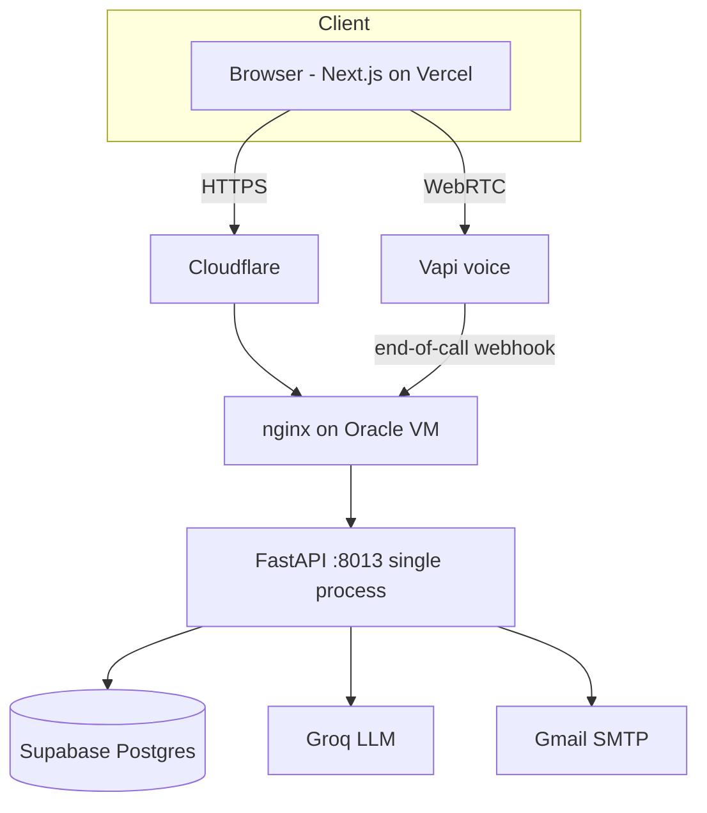
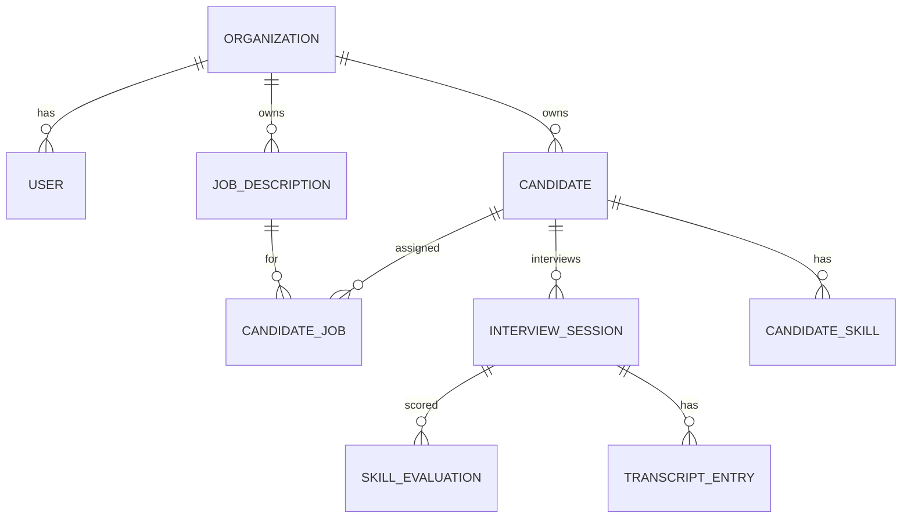
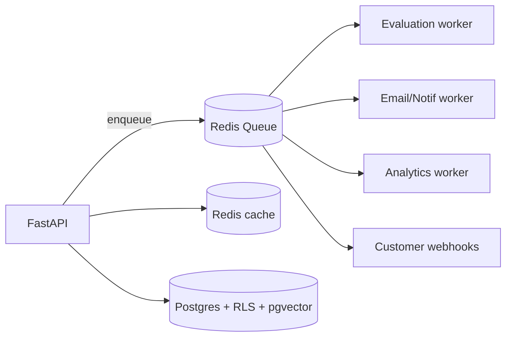

# VoxHire — Architecture, Product & Security Review

_Review date: 2026-06. Scope: full-stack audit grounded in the current codebase._
_Constraint honoured: this is an **analysis** document — it changes no code and breaks nothing. All recommendations are additive/extensible and preserve existing APIs, workflows, and integrations._

> Companion docs: [`/CLAUDE.md`](../CLAUDE.md) (agent context), this file (review & roadmap).

---

## Executive Summary

VoxHire is a multi-tenant recruiter SaaS with a genuinely differentiated core
(AI **voice** screening + interview via Vapi, automated LLM evaluation). The
codebase is clean for its stage: sensible FastAPI + async SQLAlchemy backend,
role-based auth done with real primitives (bcrypt, JWT, role dependencies),
tenant isolation by `org_id`, a webhook with secret verification, and a
seed-key-protected super-admin bootstrap. The recent Vapi migration removed a
stateful custom voice pipeline, which improves scalability.

The gaps are the expected ones for this stage, and they cluster in three places:
**(1) operational resilience** (single VM, single process, no queue/cache/monitoring,
in-process fire-and-forget evaluation), **(2) hardening** (no rate limiting,
wildcard CORS at the proxy, no server-side enforcement of interview-link
windows, no audit log), and **(3) monetization readiness** (subscriptions/billing
are entirely unbuilt — the #1 business blocker). None require breaking changes to fix.

### Scorecard (0–10)

| Dimension | Score | One-line rationale |
|---|---|---|
| Architecture | **6.0** | Clean monolith, good async; but single-VM SPOF, no queue/cache, in-process background work. |
| Security | **5.5** | Strong auth basics & tenant isolation; missing rate limiting, audit logs, link-window enforcement, tight CORS. |
| Scalability | **5.0** | Stateless API can scale, but infra is one VM/one process; evaluation & email aren't durable/queued. |
| Maintainability | **6.5** | Reasonable module boundaries & migrations; some large endpoint files, partial scaffolding, partial design-system adoption. |
| Product Maturity | **6.0** | Core loop works end-to-end; no billing, analytics, audit, integrations, or enterprise (SSO/RBAC) yet. |

**Top 5 actions by ROI** (detail in [Action Plan](#prioritized-action-plan)):
1. **P0** Subscriptions & billing module (monetization unblocker).
2. **P0** Durable background jobs (queue) for evaluation + email; add health checks & basic monitoring.
3. **P0** Rate limiting + tighten CORS + server-side interview-link expiry.
4. **P1** Audit log + Postgres RLS for defense-in-depth on tenancy.
5. **P1** Recruiter analytics dashboard + candidate ranking (AI) for retention/differentiation.

---

## Phase 1 — Product Review

### Must-have features

| Feature | Problem solved | Business / User impact | Tech complexity | Effort | Priority |
|---|---|---|---|---|---|
| **Subscriptions & billing** (plans, metering, Stripe/Razorpay, super-admin assign) | No way to charge; super-admin portal can't monetize | Unlocks revenue; usage caps; enterprise tiers | High (new module, webhooks, metering) | 3–4 wks | **P0** |
| **Durable job queue** (Arq/Celery + Redis) for evaluation, emails, screening | Eval runs as in-process `asyncio.create_task` — lost on restart, no retries | Reliability of the core deliverable (the report) | Medium | 1–2 wks | **P0** |
| **Audit log** (who did what, when) | No traceability for actions on candidates/interviews | Compliance, enterprise trust, debugging | Low–Med | 1 wk | **P0** |
| **Recruiter analytics dashboard** (funnel, time-to-hire, pass rates, per-job) | Today's dashboard is mostly cosmetic/estimated | Retention; proves ROI to buyers | Medium | 2 wks | P1 |
| **Candidate ↔ job matching / ranking (AI)** | `CandidateJob` has a score field but matching is manual | Core value; reduces recruiter effort | Medium (embeddings) | 2 wks | P1 |
| **Notifications & reminders** (interview reminders, SLA nudges) | Candidates miss interviews; no nudges | Show-up rate, completion rate | Low–Med | 1 wk | P1 |
| **SSO / SAML + granular RBAC** | Only 3 fixed roles; no enterprise identity | Enterprise sales requirement | High | 3 wks | P1 |
| **Public API + customer webhooks** | No programmatic access / ATS sync | Integrations, stickiness | Medium | 2 wks | P2 |

### Good-to-have (innovation)

- **AI recruiter copilot** (chat over a candidate: "summarize risks", "draft offer").
- **Auto question bank** generated per JD + difficulty; reusable across candidates.
- **Bias / fairness checks** on evaluations (regulatory tailwind, differentiation).
- **Candidate comparison view** (side-by-side scored radar).
- **Collaboration**: shared notes, @mentions, hiring-panel voting on reports.
- **Growth loops**: branded candidate report share links, "powered by VoxHire" on invites, referral credits.
- **Marketplace**: interview templates / question packs per role & industry.
- **Personalization**: per-org tone/branding of the AI interviewer (white-label).

---

## Phase 2 — Market Leadership Analysis

Competitors: HireVue, Micro1, Ribbon, Mercor, Karat, metaview (notetakers).
VoxHire's edge = **real-time AI voice interviewer + instant structured report**,
self-serve and affordable. Gaps vs leaders:

- **Missing**: ATS integrations (Greenhouse/Lever/Workday), analytics, bias/compliance
  reporting, enterprise identity, question libraries, multi-language, calendaring.
- **AI opportunity**: RAG-tailored questions from JD+resume; candidate ranking;
  longitudinal talent pool search (vector).
- **Differentiation**: white-label AI interviewer + open API; price transparency.
- **Monetization**: per-interview metering + seat tiers + enterprise white-label.

### Roadmap (ranked by ROI)

**3 months** — Billing & plans (P0) · durable queue + monitoring (P0) · rate
limiting/CORS/link-expiry (P0) · analytics dashboard (P1) · interview reminders (P1).

**6 months** — AI candidate ranking + RAG question generation · audit log + RLS ·
recruiter copilot · 1–2 ATS integrations · public API + webhooks.

**12 months** — SSO/SAML + granular RBAC · white-label · marketplace (templates) ·
multi-language interviews · bias/compliance reporting · talent-pool vector search.

---

## Phase 3 — Architecture Audit (HLD)

**Current state**: single FastAPI monolith (uvicorn, 1 process, port 8013) on one
Oracle VM behind nginx; Next.js frontend on Vercel; Supabase Postgres; Vapi for
voice; Groq for LLM; SMTP for email. Background work = `asyncio.create_task`.

| # | Finding | Risk | Business impact | Technical impact | Recommended solution | Migration | Effort | Priority |
|---|---|---|---|---|---|---|---|---|
| A1 | **Single VM, single uvicorn process** = SPOF, no horizontal scale, deploy = downtime | High | Outage = lost interviews | No HA, no rolling deploys | Run multiple workers (gunicorn/uvicorn workers) now; containerize; put behind a LB; later 2+ VMs or a managed platform | Additive (process manager → containers) | 1–2 wks | P0 |
| A2 | **Background eval/email via `asyncio.create_task`** — not durable, no retry, lost on restart | High | Reports silently never generated | Data loss on crash | Introduce a queue (Arq/Celery + Redis); enqueue eval & emails; idempotent workers | Wrap existing functions as tasks; no API change | 1–2 wks | P0 |
| A3 | **No caching/queue layer (Redis)** | Med | Latency, repeated LLM cost | Hot reads hit DB/LLM | Add Redis: cache configs/stats, dedupe webhook, back the queue | Additive | 1 wk | P1 |
| A4 | **Observability gap** — logging only; no metrics/tracing/alerting/health checks | High | Blind to outages (we hit a silent deploy failure) | Hard to debug prod | Add `/health` + `/ready`; structured JSON logs; Sentry; uptime monitor; basic Prometheus/OTel | Additive | 1 wk | P0 |
| A5 | **Deploy is manual & fragile** (CLI + `git pull` that can silently abort) | Med | Shipped-but-not-live bugs (happened) | Drift, wasted time | CI/CD: GitHub Actions → build, migrate, deploy, smoke-test, verify HEAD moved | Additive | 1 wk | P1 |
| A6 | Legacy `voice_runtime` (stateful WS) + `recruitment/*` scaffolding still present | Low | — | Dead code/confusion | Delete or clearly mark experimental; keep on backup branch | Safe removal | 0.5 wk | P2 |

---

## Phase 4 — LLD Review

**Strengths**: clear layering (`api/endpoints` → `modules`/`recruitment` →
`db`/`core`), Pydantic request models, async sessions, Alembic migrations,
dependency-injected auth, a real frontend design system (`components/ui`, Aura tokens).

| Finding | Impact | Recommendation | Priority |
|---|---|---|---|
| Large endpoint files (`candidates.py`, `interviews.py`) mix HTTP + business logic | Harder to test/extend | Extract a `services/` layer (use-cases); keep endpoints thin; add unit tests on services | P1 |
| **No automated tests** (no pytest/Vitest visible) | Regressions ship (e.g., the React #310 crash, the unsent invite email) | Add a test pyramid: service unit tests, API integration tests (httpx), a few Playwright E2E for the interview flow | P0 |
| Repeated `session_to_dict`-style serialization | Drift between endpoints | Centralize with Pydantic response models / mappers | P2 |
| Design-system adoption is partial (some pages still raw hex/inline styles) | Visual inconsistency, theme breakage | Continue migrating screens onto `components/ui` + tokens | P2 |
| Error handling ad-hoc; no global exception handler / error schema | Inconsistent client errors | Add FastAPI exception handlers + a typed error envelope | P1 |
| Config via `pydantic-settings` (good); secrets in `.env` (gitignored ✓) | OK | Move prod secrets to a secrets manager (see S5) | P1 |

DDD opportunity: model **Recruiting**, **Interviewing**, **Billing**, **Identity**
as bounded contexts now (as modules) so they can later split into services.

---

## Phase 5 — Database Audit

**Current**: Supabase Postgres; multi-tenant by `org_id` FK + app-level filtering;
`InterviewSession` carries many JSON eval columns; ~38 index/unique/FK declarations;
indexes on `users.email`, `interview_sessions.link_token`.

| Finding | Risk | Recommendation | Priority |
|---|---|---|---|
| **Tenancy enforced only in app code** (every query must remember `org_id`) | High — one missed filter = cross-tenant leak | Add **Postgres Row-Level Security** (RLS) policies on `org_id` as defense-in-depth | P1 |
| Missing composite indexes for hot paths (`interview_sessions(org_id, status)`, `candidate_jobs(candidate_id)`, `candidates(org_id, email)`) | Med — slows as data grows | Add composite/covering indexes; verify with `EXPLAIN` | P1 |
| **N+1 / sequential awaits** in `get_vapi_config`, candidate detail (separate skill/session queries) | Low now, grows | Use `selectinload`/joined loads; batch | P2 |
| Eval stored as many **JSON columns** — not queryable/indexable for analytics | Med | Keep JSON for raw, project key metrics into typed columns/a `metrics` table for analytics | P1 |
| No **data retention / PII lifecycle** (resumes, transcripts, recordings) | Med — GDPR/DPDP | Define retention + deletion (per-org), soft-delete + purge jobs | P1 |
| No partitioning/archival | Low at current scale | Defer; revisit when interviews/transcripts grow large | P2 |

ER (core):

---

## Phase 6 — Security Audit

| # | Vulnerability | Risk | Exploit scenario | Fix |
|---|---|---|---|---|
| S1 | **No rate limiting** anywhere | High | Brute-force `/auth/login`; abuse `/candidates/bulk-parse` (LLM cost); enumerate `vapi-config`/`join` | Add `slowapi`/gateway limits per IP + per user; stricter on auth & LLM endpoints | 
| S2 | **Wildcard CORS at nginx** (`Access-Control-Allow-Origin *` for `/voxhire/`, overriding app's single-origin) | Med | Any site can call the API with a stolen bearer token | Restrict ACAO to known origins (app domain + Vapi); keep `X-Interview-Token` allowed | 
| S3 | **Interview-link window not enforced server-side** (15-min gate is client-only; `link_token` is a long-lived bearer in URL/localStorage) | Med | After/ before window, or after completion, the token still authorizes `vapi-config`/transcript APIs directly | Enforce scheduled-window + single-use/expiry on `link_token` in the backend; rotate/invalidate post-interview | 
| S4 | **No audit log** | Med | No forensics on data access/changes | Append-only audit table for sensitive actions | 
| S5 | **Secrets management** — prod creds in server `.env`; weak DB password observed | Med | VM compromise → full DB/LLM/SMTP creds; weak password aids lateral movement | Move to a secrets manager / Vercel+Oracle env; rotate creds; strong DB password | 
| S6 | **JWT** HS256, no revocation/blocklist; refresh handling | Low–Med | Stolen token valid until expiry | Short access TTL (have), add server-side revocation list for logout/compromise | 
| S7 | **PII at rest** (resumes, transcripts, emails, phones) — no documented encryption/retention | Med | Data-subject/regulatory exposure | Rely on Supabase encryption-at-rest + add app-level retention/deletion & a DPA | 
| S8 | LLM prompt-injection via resume/JD text into Groq prompts | Low–Med | Malicious resume manipulates evaluation/questions | Delimit & sanitize user text in prompts; never let model output drive privileged actions | 

**Good (verified)**: `.env` gitignored; bcrypt password hashing; role dependencies
(`require_org_admin`/`require_super_admin`); super-admin bootstrap gated by seed key +
one-time check; Vapi webhook verifies `X-Vapi-Secret`; tenant filtering by `org_id`.

### Threat model (STRIDE, abbreviated)
- **Spoofing**: JWT + bcrypt ✓; add MFA for super-admin.
- **Tampering**: webhook secret ✓; add request signing/HTTPS-only (have).
- **Repudiation**: ❌ no audit log → add (S4).
- **Information disclosure**: tenancy app-only (S? add RLS), CORS (S2), PII (S7).
- **DoS**: ❌ no rate limiting (S1).
- **Elevation of privilege**: role checks ✓; verify every endpoint enforces org scope.

---

## Phase 7 — AI Opportunities

| Capability | Business value | Technical design | Effort |
|---|---|---|---|
| **RAG question generation** (JD + resume → tailored questions) | Sharper interviews, differentiation | Embed JD/resume → retrieve → Groq prompt to generate per-skill questions; pass to Vapi as `variableValues` | Med (2 wks) |
| **Candidate ranking/matching** | Saves recruiter time; fills the `CandidateJob.score` | Embed candidates + JD (pgvector/Qdrant), cosine match + LLM rationale | Med (2 wks) |
| **Recruiter copilot** (chat over candidate/report) | Engagement, faster decisions | RAG over transcript+report+resume; tool-use for actions | Med (2–3 wks) |
| **Evaluation bias/consistency checks** | Compliance, trust | Second-pass LLM rubric + variance checks across candidates | Low–Med |
| **Talent-pool semantic search** | Re-engage past candidates (growth loop) | Vector index over all candidates; "find me a Python lead who interviewed well" | Med |
| **Auto-summary & highlights** of interviews | Faster screening | Already partially via eval; expose timestamped highlights | Low |

Foundation: add **pgvector** to Supabase (no new infra) for embeddings/RAG.

---

## Phase 8 — UI/UX Review

- **Journey**: solid core (schedule → invite → interview → report). Add guided
  **onboarding** for new orgs (create job → upload → first interview in <5 min).
- **Dashboard**: currently partly cosmetic/estimated numbers → make metrics real (ties to analytics, Phase 1).
- **Consistency**: design system exists (Aura tokens + `components/ui`); **finish migrating** remaining screens off raw hex/inline styles (started in the theme phases).
- **Accessibility**: global focus rings + reduced-motion added; do a keyboard/AT pass on dashboard tables, modals, the schedule calendar.
- **Mobile**: verify dashboard tables and the schedule flow on small screens; candidate interview page is desktop-first (acceptable, but show a friendly "use desktop" notice on mobile).
- **Conversion/retention**: branded candidate report share links; recruiter email digests; empty-state CTAs (already added on some pages).

---

## Phase 9 — Extensibility (10x / 100x)

Target: **add features with minimal change to existing code.**

1. **Bounded contexts as modules now** → `identity`, `recruiting`, `interviewing`,
   `evaluation`, `billing`, `notifications`. Each owns its models/services/routes.
   Later, peel any into its own service without touching others.
2. **Stateless API + externalized state** (Redis for queue/cache/sessions) → scale
   horizontally behind a LB. (Vapi already offloads the stateful voice path.)
3. **Event bus** (Redis streams/queue): emit `interview.completed`,
   `candidate.created` → evaluation, notifications, analytics, webhooks subscribe.
   New consumers = new features with zero changes to producers.
4. **Provider abstractions**: wrap LLM (Groq), voice (Vapi), email (SMTP), payments
   behind interfaces so vendors swap without rippling.
5. **Plugin points for white-label**: per-org theming/branding config; per-org
   assistant overrides (already pass `variableValues`).
6. **Public API versioning** (`/api/v1` exists) + customer webhooks for integrations.

---

## Phase 10 — Documentation & Engineering Standards

**To produce** (tracked as docs in `/docs`): HLD (context/component/deployment —
seeded above), LLD (module/sequence per flow), DB (ER above + index/retention),
Security (threat model above + controls + compliance checklist), and runbooks.

**Engineering standards to adopt:**
- **Naming**: snake_case (Py), camelCase (TS), PascalCase types/components.
- **Folders**: by bounded context, not by type, as the app grows.
- **API**: `/api/v{n}`, plural nouns, typed Pydantic req/resp, consistent error envelope, pagination on lists.
- **DB**: every change via Alembic; FKs + indexes on FKs; `created_at/updated_at` on all tables; RLS for tenant tables.
- **Logging**: structured JSON, request id, no PII/secrets in logs.
- **Errors**: never swallow silently (we lost an email + a deploy that way); central handlers.
- **Testing**: PRs require service unit tests; CI runs tests + typecheck + build; E2E for the interview happy-path.
- **Git/CI-CD**: trunk-based with short-lived branches; CI must build+migrate+smoke-test and **verify the deploy landed** (HEAD moved / asset hash changed).

---

## Prioritized Action Plan

| Rank | Action | Phase | Priority | Effort | Why (business × engineering) |
|---|---|---|---|---|---|
| 1 | Subscriptions & billing module (+ super-admin plan mgmt) | 1/2 | P0 | 3–4 wks | Unblocks all revenue |
| 2 | Durable queue for evaluation+email; health checks; Sentry + uptime | 3 | P0 | 2 wks | Protects the core deliverable; ends silent failures |
| 3 | Rate limiting + tighten CORS + server-side link expiry | 6 | P0 | 1 wk | Closes the highest-likelihood abuse/leak paths |
| 4 | Automated tests + CI/CD with deploy verification | 4 | P0 | 2 wks | Stops regressions (already bit us twice) |
| 5 | Audit log + Postgres RLS | 5/6 | P1 | 1.5 wks | Enterprise trust + tenancy defense-in-depth |
| 6 | Recruiter analytics dashboard (real metrics) | 1 | P1 | 2 wks | Retention; proves ROI |
| 7 | AI candidate ranking + RAG questions (pgvector) | 7 | P1 | 3 wks | Core differentiation |
| 8 | Multi-worker + containerize + (later) 2nd VM/LB | 3/9 | P1 | 2 wks | Removes SPOF; enables scale |
| 9 | SSO/SAML + granular RBAC | 1 | P1 | 3 wks | Enterprise deals |
| 10 | Public API + customer webhooks; 1 ATS integration | 2 | P2 | 3 wks | Stickiness, integrations |

_All items above are additive and preserve current behavior. Sequence P0s first
(billing in parallel with reliability/security since they touch different areas)._
